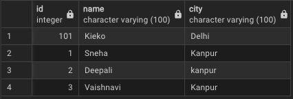
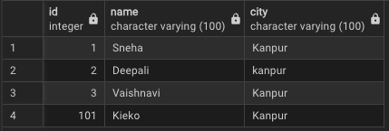
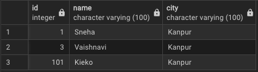

# PostgreSQL
 ---
 ```sql
 CREATE DATABASE person;
 ```
 ---
 ---
 # READING DATA IN TABLE

## SQL Query

```sql
SELECT*FROM person;
```
## Output
()

---

---
# UPDATING DATA IN TABLE

## SQL Query

```sql
UPDATE person
SET CITY='Kanpur'
WHERE id=101;
```
## Output
()

---
# DELETE DATA IN TABLE

## SQL Query

```sql
DELETE FROM person
WHERE id=2;
```
## Output
()

---

